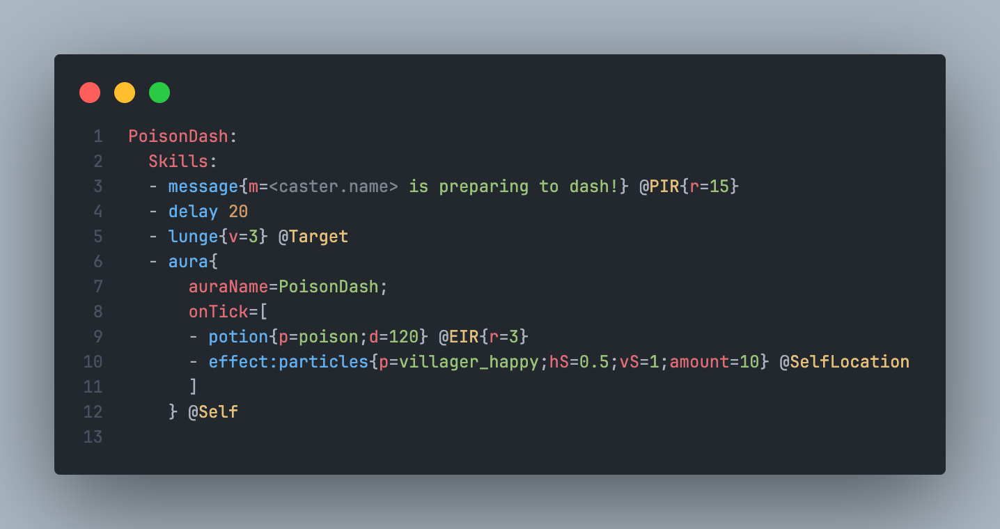
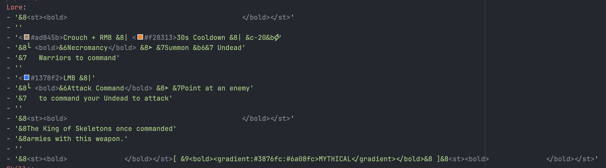

<h1> VSCode Mythic</h1>

    
    

A Visual Studio Code extension that adds language support for MythicMobs configurations.

## 📖 Table of Contents

- [📖 Table of Contents](#-table-of-contents)
- [🚀 Features](#-features)
  - [🎉 Current](#-current)
    - [Basic Syntax Highlighting](#basic-syntax-highlighting)
    - [Go to definition and references](#go-to-definition-and-references)
    - [Color decorations](#color-decorations)
  - [🚧 Planned](#-planned)
- [🚩 Current Limitations](#-current-limitations)
- [📦 Installation](#-installation)
- [📝 License](#-license)
- [❤️ Credits and Acknowledgements](#️-credits-and-acknowledgements)

## 🚀 Features

### 🎉 Current

#### Basic Syntax Highlighting

(Using the [One Dark Pro](https://marketplace.visualstudio.com/items?itemName=zhuangtongfa.Material-theme) theme and the [CodeSnap](https://marketplace.visualstudio.com/items?itemName=adpyke.codesnap) extension)

#### Go to definition and references

(Todo: Add gif)

#### Color decorations

Below is a screenshot of item lore configuration (Credits: @LcorpOfficial):

### 🚧 Planned

- Complete data set
- Autocompletions

## 🚩 Current Limitations

- The extension is not built with YAML aliases in mind. This might be changed in the future, but for now, they will lead to unexpected behavior.
- The extension is meant to be used in one single workspace/server. It is not (yet?) possible to use it in multiple workspaces/servers at once.

## 📦 Installation

Install the extension from the [Visual Studio Marketplace](https://marketplace.visualstudio.com/items?itemName=0tickpulse.vscode-mythic)

## 📝 License

This project is licensed under AGPLv3. A copy can be found [here](./LICENSE).

## ❤️ Credits and Acknowledgements

- Microsoft and the VSCode team, for providing the [Language Server Protocol](https://microsoft.github.io/language-server-protocol/), [VSCode Extension API](https://code.visualstudio.com/api), [YAML tmLanguage](https://code.visualstudio.com/api/language-extensions/syntax-highlight-guide), and more.
- [MythicMobs](https://www.mythicmobs.net/) and [its community](http://www.mythicmobs.net/discord), for creating and maintaining the plugin.
- Every contributor on my discord server, for helping me with testing and providing feedback.
